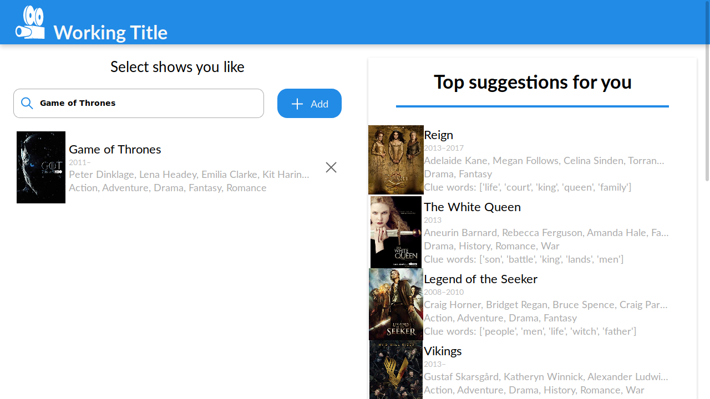
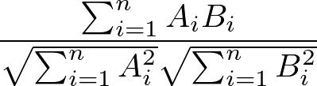
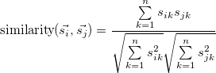
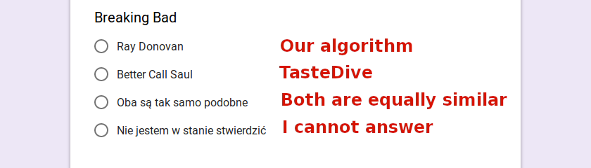
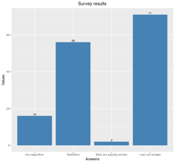

# TV Show Recommendations based on Textual Similarity of Subtitles

*Authors*: [Ivan Rukhavets](https://github.com/vanruch), [Kamil Grabowski](https://github.com/Kamig95), [Piotr Halama](https://github.com/ptrhlm)

**This project was created during [Case Studies, W19](https://github.com/pbiecek/CaseStudies2019W) course at [MiNI PW](https://ww4.mini.pw.edu.pl/)**

The goal of the project was to evaluate a novel method of creating recommendations for TV shows, based on the subtitles from first few episodes and develop application for presenting these recommendations.
Our method is based on cosine similarity between TV show embeddings, which is then used to rank and select best fitting recommendations.

While the embeddings capture a similarity of some kind, our survey showed it was not of the kind that people would use to find next show to watch.

#### 0. Contents

  - [1. Application](#1-application)
  - [2. Technologies used](#2-technologies-used)
  - [3. Model](#3-model)
    - [3.1. Data preparation](#31-data-preparation)
    - [3.2. Comparison method](#32-comparison-method)
  - [4. Survey](#4-survey)
    - [4.1. Results](#41-results)
    - [4.2. Discussion](#42-discussion)
    - [4.3. Conclusion](#43-conclusion)

## 1. Application



Our app displays recommendations generated by our model.
You can visit a live instance at [warsztaty.netlify.com](https://warsztaty.netlify.com).

The user interface of the application is split in two parts vertically.
The part on the left allow user to enter the titles of the shows, on which the recommendations should be based (e.g. the shows you like).
You can add as many shows as you like - the recommendation engine will take all of the into consideration.
The results will be displayed on the right, sorted by relevance.

On the list with results, each TV show has a 'Clue words' field added.
This field contains the nouns that influenced the choice the most.

### 1.1. Self-hosting

In order to start the server, execute following commands:

```bash
cd frontend
yarn  # only once, to install dependencies
yarn start
```

The app will be running at `localhost:3000`

## 2. Technologies used

Techonologies used in the frontend:
  - JavaScript
  - [React](https://reactjs.org/)

Technologies used in the creation of the recommendation model:
  - Python
  - [numpy](http://www.numpy.org/)
  - [pandas](https://pandas.pydata.org/)
  - [gensim](https://radimrehurek.com/gensim/)
  - [spacy](https://spacy.io/)
  - [fastText embeddings](https://fasttext.cc/)

## 3. Model

### 3.1. Data preparation

As a training data set we have used items from the [IMDb datasets](https://datasets.imdbws.com/) tagged as `tvSeries` or `tvMiniSeries`  created after 1970 with at least 10000 user rates, resulting in 990 selected shows.
Next we have downloaded subtitles of first few episodes for each season of every show from [opensubtitles.org](opensubtitles.org).
The data has been found for more than 4000 episodes of 872 shows.
Lastly, we perform removal of metadata (i.e. indexes or timestamps) from the `.srt` files.

The resulting corpus of TV series subtitles can be found [here](https://drive.google.com/open?id=1EydDpkS8LuP_vjp7g1A6hEa08ezL7Jf7).

### 3.2. Ranking method
For each TV show in our dataset we compute an embedding by calculating the mean of the word embeddings of the most common 100 nouns found in subtitles of the first few episodes.

<p align="center">
  
</p>

<!--
\[\vec{s_i} = \frac{1}{100}\sum\limits_{w \in W_i} \vec{w}\]
-->

where  is set of 100 most common nouns in the i-th show subtitles.

Word embeddings we use come from [FastText pretrained on Wikipedia](https://fasttext.cc/docs/en/english-vectors.html).

The similarity of a pair of TV shows is defined as cosine similarity of their embeddings:

<p align="center">
  
</p>

<!--
\[\text{similarity}(\vec{s_i}, \vec{s_j}) = \frac{\sum\limits_{k=1}^{n} s_{ik}s_{jk}}{\sqrt{\sum\limits_{k=1}^{n} s_{ik}^2}\sqrt{\sum\limits_{k=1}^{n}s_{jk}^2}}\]
-->

For every TV series in our database, we compute its similarity with every other TV series we have. 
We use the calculated similarities to rank them (sorting order is descending; from 1 to -1).
Finally, we select top 3 results as our recommendation.

## 4. Survey

The quality of our solution has been tested by comparing it to [TasteDive](https://tastedive.com/), a website which helps to find similar music, movies, TV shows, books, authors and games.

We conducted a survey, the copy of which can be found [here](https://goo.gl/forms/tHUYKyld723O0ptw1).

Each participant was tasked with assigning to each of the 24 TV shows one of the 4 answers:

<p align="center">
  
</p>

### 4.1. Results
<p align="center">
  
</p>
<!---
Shows chosen by our algorithm have been selected 16 times, shows chosen by TasteDive have been selected 56 times, answer "Both are equally similar" has been chosen only 2 times and answer "I can not tell" has been chosen 71 times.
-->

We received 6 responses to our survey.

Shows chosen by our algorithm won 6 times, while shows chosen by TasteDive won 14 times.
We define winning as receiving the most votes for a given question.

### 4.2. Discussion

The assignment of similar series to "Death Note" and "Cowboy Bebop" gave interesting results.

"Death Note" is an anime and crime show. Our algorithm found the series the most similar to it to be "Sherlock", which is also a crime show, but not an animation.
TasteDive chose "Code Geass", which is an anime like "Death Note", but the genre of the series is completely different.

We encounter similar situation with "Cowboy Bebop", which is an anime with the action taking place in the future (space ships and interplanetary travels are important elements of the plot).
Meanwhile, our algorithm chose "Futurama" to be the most similar to it.
It is a cartoon, which also takes place in future and spaceships and interplanetary travels are important elements of the plot, too. 
TasteDive instead had chosen "Samurai Champloo", which is an anime set in completely different time than "Cowboy Bebop".

### 4.3 Conclusion
In both cases described above most people have chosen shows proposed by TasteDive.

It is obvious in the hindsight that modelling the taste of the users is too important to ignore in the domain of recommendation systems.
We have chosen unsupervised approach to the problem solely because of lack of the data, hoping that generic word embeddings could contain the required semantic information we needed.

Our hopes weren't baseless, as shown by the results of our survey: sometimes our algorithm won the competition.
The TV show embeddings seem to capture at least some part of information that could be used in providing recommendations: the topic and sometimes the genre.

We believe that with enough data this approach could be taken a lot further: 
  - using transfer learning to make embeddings better describe the domain
  - creating TV show embedding with a seq2vec encoder trained on some task
