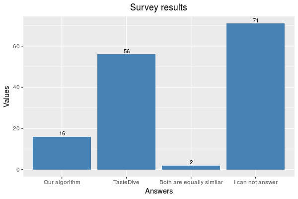

# TV Show Recommendations based on Textual Similarity of Subtitles
*Authors*: Ivan Rukhavets, Kamil Grabowski, Piotr Halama

**TODO**: Abstract

## Introduction

  ### Wstęp
  Celem projektu jest określenie podobieństwa seriali na podstawie napisów z ich kilku pierwszych odcinków oraz przygotowanie aplikacji, która dla serialu wybranego z przygotowanej przez nas listy wskaże kilka najbardziej podobnych seriali.

**TODO**: use cases

## Solution

### Data preparation
  ### Przygotowanie danych
  Jako zbiór danych wybraliśmy wszystkie seriale z portalu IMDB\footnote{https://www.imdb.com/} stworzone po roku 1970 i mające co najmniej 10000 ocen. Dostaliśmy 990 tytułów. Następnie próbowaliśmy pobrać pierwsze odcinki każdego sezonu seriali ze strony opensubtitles.org. Udało nam się pozyskać co najmniej jeden odcinek dla 872 seriali i ponad 4000 odcinków w sumie. Dalszym krokiem było przygotowanie rozpakowanych plików \textit{srt}. Wiązało się to z pewnymi trudnościami, gdyż API opensubtitles nie jest do końca spójne i niektóre odcinki nie były zarchiwowane, niktóre były w formacie \textit{zip}, a niektóre – w \textit{tar.gz}. Następnie należało się pozbyć metadanych napisów, t.j. kody czasowe. Format \textit{srt} ma prostą specyfikację\footnote{Specyfikacja SRT: https://matroska.org/technical/specs/subtitles/srt.html}, więc nie wywołało to większych problemów. W wyniku dostaliśmy pliki tekstowe zawierające tylko tekst napisów odcinków seriali.
  
**TODO**: Dalej - stopwods, lemmatization, steming etc.

### Comparison method

  ### Metoda porównywania seriali
  Najpierw łączymy kilka pierwszych odcinków serialu w jeden napis, a następnie wybieramy z niego sto najczęściej występujących rzeczowników. Przy pomocy fastTextu znajdujemy dla każdego z tych rzeczowników word embedding. Wyznaczamy word embedding serialu jako średnią z wcześniej otrzymanych embeddingów. Ostatecznie dla każdego serialu znajdujemy te, które są do niego podobne przy użyciu podobieństwa kosinusowego:

[comment]: # (\[\frac{\sum_{i=1}^{n}A_i*B_i}{\sqrt{\sum_{i=1}^{n}A_i^2}*\sqrt{\sum_{i=1}^{n}B_i^2}}\])

### Implementation details
**MAYBE**

## Results
The quality of our solution has been tested by comparing it to TasteDive, website which helps to find similar music, movies, tv shows, books, authors and games.
We conducted surveys, which can by found at the following address: .
Each participant had a task to assign to each of the 24 tv shows one of the 4 answers: show chosen by our algorithm, show chosen by TasteDive, "Both are equally similar" and "I can not tell".

<!---
Shows chosen by our algorithm have been selected 16 times, shows chosen by TasteDive have been selected 56 times, answer "Both are equally similar" has been chosen only 2 times and answer "I can not tell" has been chosen 71 times.
-->
We consider that one of pairs of series assigned to a given tv show won if it had more votes.
Shows chosen by our algorithm won 6 times and shows chosen by TasteDive won 14 times.

Assignment of similar series to "Death Note" and "Cowboy Bebop" gave interesting results.

### Death Note
"Death Note" is anime and crime show, our algorithm found the series the most similar to it to be "Sherlock", which is also crime show, but not animation.
TasteDive chose "Code Geass" which is anime like "Death Note", but subject matter of series is completely different.

### Cowboy Bebop
Similar situation is with "Cowboy Bebop", it is anime, the action takes places in the future (space ships and interplanetary travels are important elements of plot).
Our algorithm chose "Futurama" to be the most similar to it.
It is cartoon, which takes places in future and spaceships and interplanetary travels are also important elements of plot. TasteDive chose "Samurai Champloo", which is anime, but it takes place in completely different time than "Cowboy Bebop".

## Related work 
**TODO**

## Conclusion
In both cases described above most people chose shows proposed by TasteDive.
It shows that our algorithm sometimes makes decisions, which are not obvious to people, because it is based only on words and there are other things, that are important to people watching tv shows.
Such as style of animation or fact, that show is live action.

