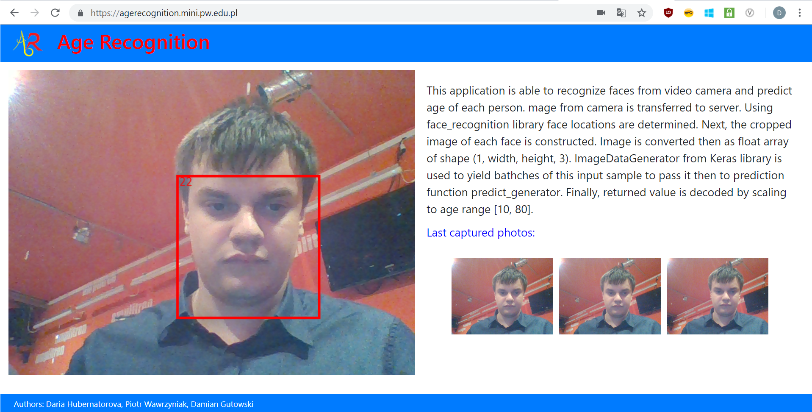
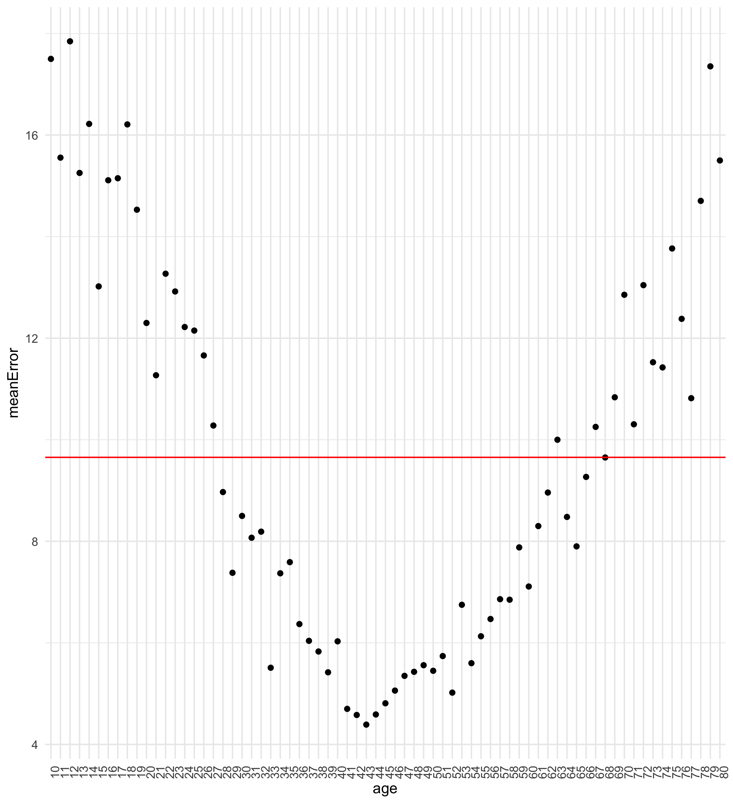
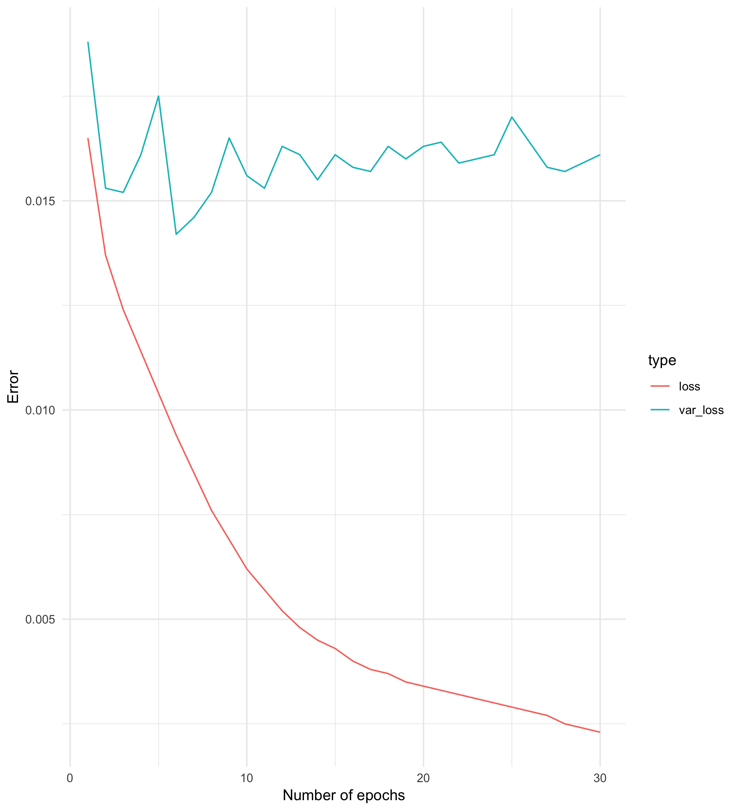

# Age recognition
*Authors* : Daria Hubernatorova, Piotr Wawrzyniak, Damian Gutowski

  - https://github.com/damian9550/age-recognition-be
  - https://github.com/piotrek29100/age-recognition-client
  - https://github.com/piotrek29100/age-recognition

The goal of the project was to recognize faces from video camera input and show predicted age. Prediction is based on trained neural network. 
Our method shows similar results as another method on the same dataset.

#### 0. Contents

  - [1. Application](#1-application)
    - [1.1 Modules](#11-modules)
  - [2. Technologies used](#2-technologies-used)
  - [3. Neural network architecture and training](#3-neural-network-architecture-and-training)
    - [3.1. Architecture](#31-architecture)
  - [4. Exeriment](#4-experiment)

## 1. Application
How to use application?
1. Open the site https://agerecognition.mini.pw.edu.pl
2. Allow to use camera when asked.


When face is recognized, frame appears with predicted age inside it. If there is no frame try to move closer to camera.

### 1.1. Modules
Application is composed of 2 main modules (Back-end server and Front-end client).
Detailed technical installation and self-hosting instructions can be found here:
  - https://github.com/damian9550/age-recognition-be
  - https://github.com/piotrek29100/age-recognition-client
  
### 1.2 Self hosting
```bash
cd age-recognition-be
flask run
cd age-recognition-client
ng serve
```
Web page then is available under http://localhost:4200
  
## 2. Technologies used
 
 - [Angular CLI](https://github.com/angular/angular-cli)
 - [Python](https://www.python.org/downloads/release/python-360/)
 - [numpy](http://www.numpy.org)
 - [Flask](http://flask.pocoo.org)
 - [Pillow](https://github.com/python-pillow/Pillow/)
 - [Face Recognition](https://github.com/ageitgey/face_recognition)
 - [Keras](https://keras.io)
 - [TensorFlow](https://www.tensorflow.org)

 
## 3. Neural network architecture and training
Age is predicted by a deep neural network. We have tested two approaches presented below.
https://github.com/piotrek29100/age-recognition
### Training from scratch
Modeling a custom network is often time-consuming task. During such a process, it is necessary to check repeatedly what accuracy the current model achieves. Therefore we have used VGG_Face architecture to test how promising is training from scratch. Unfortunately, results and learning speed were unacceptable so this aproach has been abandoned on the first stages of the project.
### Transfer learning approach
In this case, we have used InceptionV3 network trained on the ImageNet dataset (composed of 1'331'167 images).

### 3.1. Architecture
InceptionV3 consists of eleven main blocks. Each subsequent block detects more and more complex shapes. Thanks to this construction, the first blocks are versatile enough to be used without any changes for other tasks.
Before training process, top classification layers was replaced by global spatial average pooling layer and three dense layers (relu, relu, sigmoid) with respectively 1024, 128 and 1 units. To prevent overfiting, dropout layer with 20% threshold has been included between first and second classification layer.
The training was divided into stages. At each stage less layers were frozen and the network was trained until further learning did not improve the result.

Stages:
* frozen 311 layers (all except categorical layers)
* frozen 249 layers (all except two last blocks)
* frozen 229 layers (all except three last blocks)
* frozen 197 layers (all except four last blocks) >> no improvement

## 4. Experiment
### What we wanted to check?
After building the above architecture of neural network, our aim was to check how good are the predictions and is the built solution stable. 

### Predictions accuracy
We used images from the same dataset, not seen by network, as test dataset. The final results on test dataset are similar to compared approach https://data.vision.ee.ethz.ch/cvl/rrothe/imdb-wiki/ .
As a discussion of obtained results: meanwhile face recognition algorithm has its error, which might have been transferred to error in final prediction. Also dataset of images used for training contained 230000 images. In this data, several persons had more than one image, which gives less diversified data for our network.
Graph below represents mean error on test dataset for each year of person between 10 and 80 years. From the graph we conclude that results from neural network can be improved by additional predictors. The curve obtained shows small errors for people between 30 and 60 years, and big errors for children and older people. This is in accordance to distribution of images in dataset.

Distribution of age in dataset:

How error changed with number of epochs:

 ### Stability issues
 We checked our solution by asking people to use our application. Predictions were not stable while the same person was looking into camera. Reasons for this could be: poor image quality and not steady image predictions. Predictions are made every 2 seconds, but during this interval person is moving and transferred image to network can be distorted. Images used for training are steady and have better quality in comparison with live predictions.
 We noticed that quality depends on conditions of surroundings (e.g. light) and how close person is to camera. More closer face image gives more accurate results.
